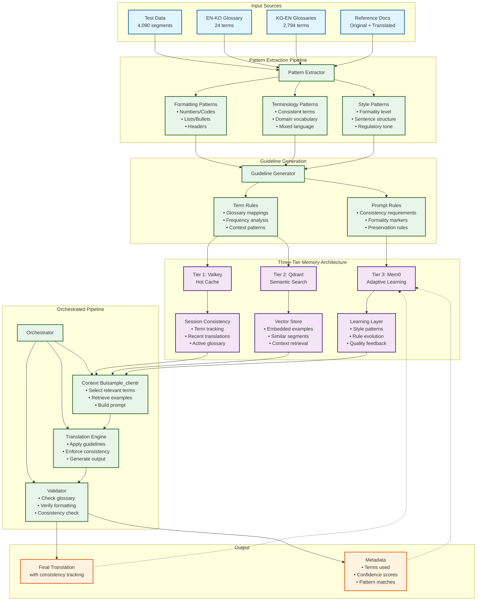

# Phase 2 Translation System Architecture

## Complete System Flow: From Test Data to Translation

## Architecture Components

### 1. Input Processing
- **Test Data**: 4,090 segments serve as both test and reference
- **Glossaries**: Asymmetric (24 vs 2,794 terms) requiring different strategies
- **Reference Docs**: Full documents for context understanding

### 2. Pattern Extraction (Initialization Phase)
- **Formatting Patterns**: How numbers, lists, headers are preserved
- **Terminology Patterns**: Common terms and their consistent translations
- **Style Patterns**: Formality levels, sentence structures, regulatory tone

### 3. Guideline Generation
- **Prompt Rules**: System instructions derived from patterns
- **Term Rules**: Glossary mappings with frequency weights

### 4. Three-Tier Memory System
- **Tier 1 (Valkey)**: Fast lookup for current session consistency
- **Tier 2 (Qdrant)**: Semantic search for similar examples
- **Tier 3 (Mem0)**: Long-term pattern learning and adaptation

### 5. Orchestrated Pipeline
- **Context Buisample_clientr**: Intelligently selects relevant information
- **Translation Engine**: Applies all rules and guidelines
- **Validator**: Ensures consistency and compliance

### 6. Feedback Loop
- Results feed back into Mem0 for continuous improvement
- Metadata tracks which patterns and terms were used

## Key Design Principles

1. **No TM Available**: Test data becomes the implicit translation memory
2. **Asymmetric Glossaries**: EN-KO (24 terms) vs KO-EN (2,794 terms) need different handling
3. **Pattern-Driven**: Extract and apply patterns rather than loading everything
4. **Consistency First**: Track and enforce term consistency within documents
5. **Regulatory Compliance**: Formal tone and exact terminology required