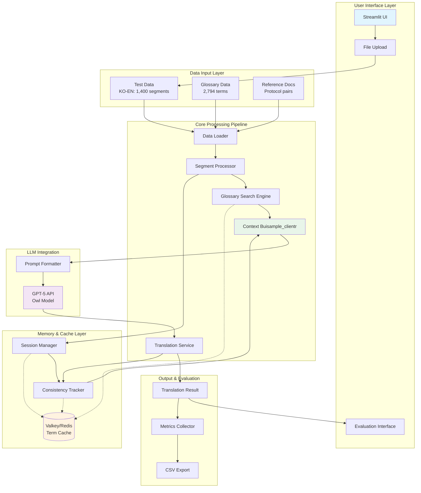
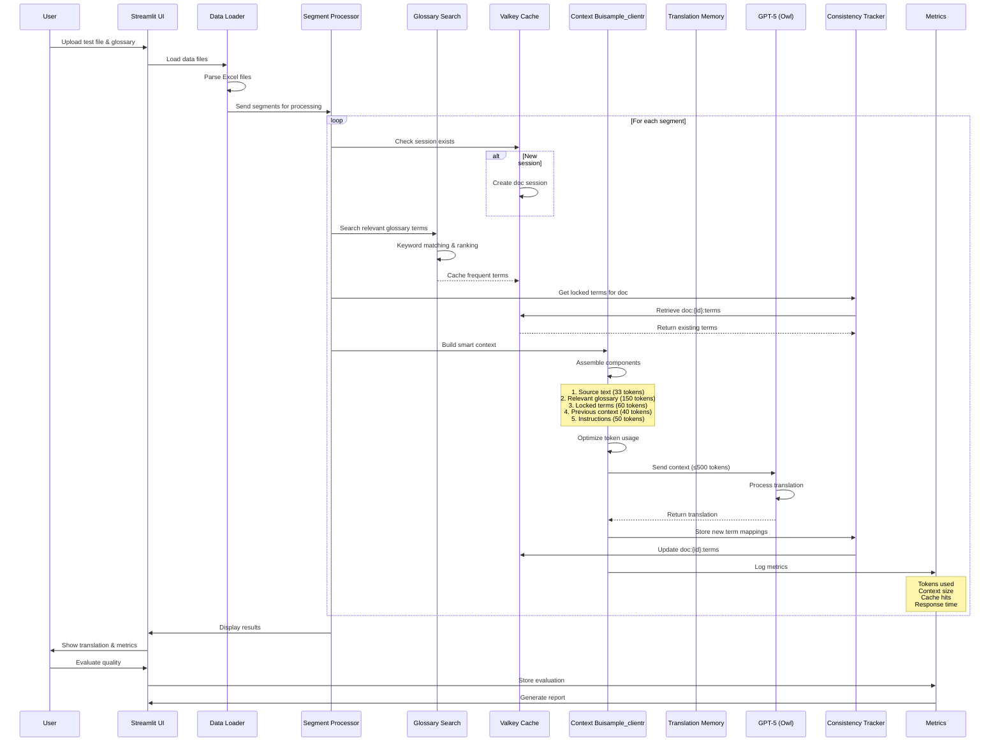
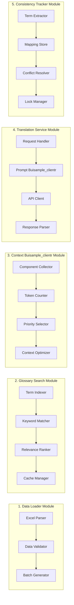
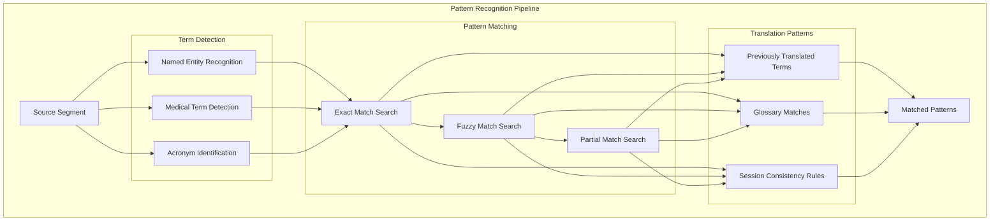
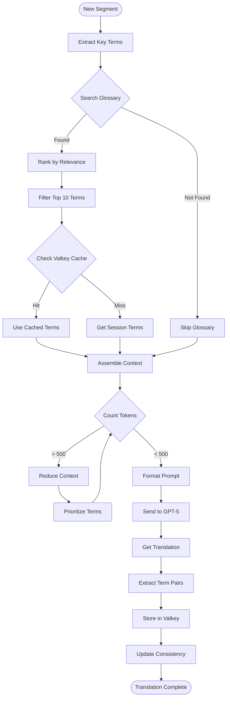
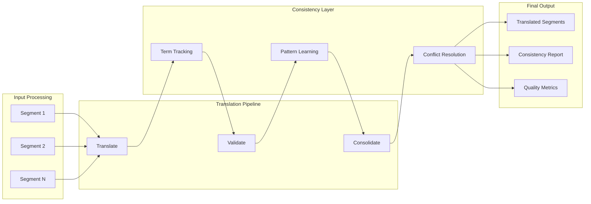
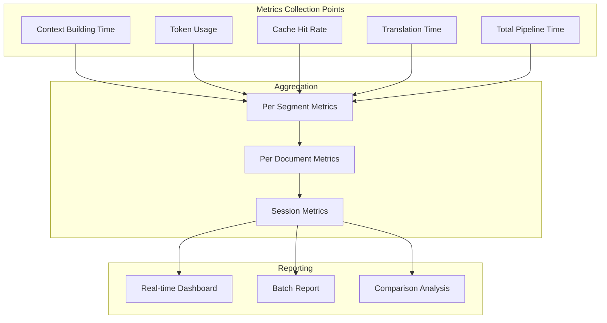
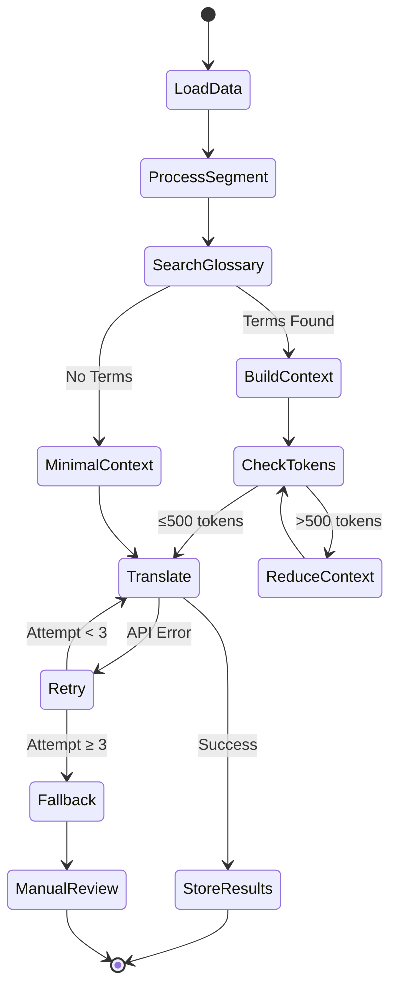

# Phase 2 MVP Architecture Diagram

## System Architecture Overview



## Detailed Data Flow Diagram



## Core Module Architecture



## Pattern Recognition & Matching Flow



## Context Assembly Pipeline



## Memory Management Architecture

```mermaid
graph TB
    subgraph "Valkey/Redis Cache Structure"
        subgraph "Document Sessions"
            DS1[doc:123:metadata]
            DS2[doc:123:terms]
            DS3[doc:123:segments]
        end
        
        subgraph "Term Consistency"
            TC1[term:source->target]
            TC2[lock:123:term]
            TC3[freq:123:term]
        end
        
        subgraph "Cache Optimization"
            CO1[glossary:cache]
            CO2[pattern:cache]
            CO3[context:cache]
        end
    end
    
    subgraph "Access Patterns"
        AP1[O(1) Term Lookup]
        AP2[Session Scoped]
        AP3[TTL Management]
    end
    
    DS2 --> TC1
    TC1 --> TC2
    TC2 --> TC3
    
    AP1 --> DS2
    AP2 --> DS1
    AP3 --> DS3
```

## Translation Consolidation Flow



## Performance Metrics Flow



## Error Handling & Recovery



## Component Interaction Matrix

| Component | Data Loader | Glossary Search | Context Buisample_clientr | Translation | Valkey | Metrics |
|-----------|------------|-----------------|-----------------|-------------|---------|---------|
| **Data Loader** | - | Provides glossary | Sends segments | - | - | Log load time |
| **Glossary Search** | Receives glossary | - | Returns matches | - | Cache results | Hit/miss rate |
| **Context Buisample_clientr** | Receives segments | Requests terms | - | Sends context | Get cached terms | Context size |
| **Translation** | - | - | Receives context | - | Store translations | Token usage |
| **Valkey** | - | Provides cache | Provides terms | Stores results | - | Cache metrics |
| **Metrics** | Track performance | Track efficiency | Track optimization | Track quality | Track cache | - |

## Key Design Decisions

### 1. Modular Architecture
- Each module has single responsibility
- Clear interfaces between components
- Easy to test and debug individually
- Can swap implementations (e.g., different search algorithms)

### 2. Cache-First Design
- Check Valkey before expensive operations
- Cache glossary searches
- Store term mappings for consistency
- Session-based isolation

### 3. Token Optimization Priority
- Count tokens at each step
- Prioritize high-value terms
- Dynamic context adjustment
- Fallback strategies for edge cases

### 4. Stream Processing
- Process segments sequentially
- Build consistency incrementally
- Learn patterns during translation
- Real-time metrics collection

### 5. Fail-Safe Mechanisms
- Graceful degradation on cache miss
- API retry with exponential backoff
- Fallback to minimal context
- Manual review queue for failures