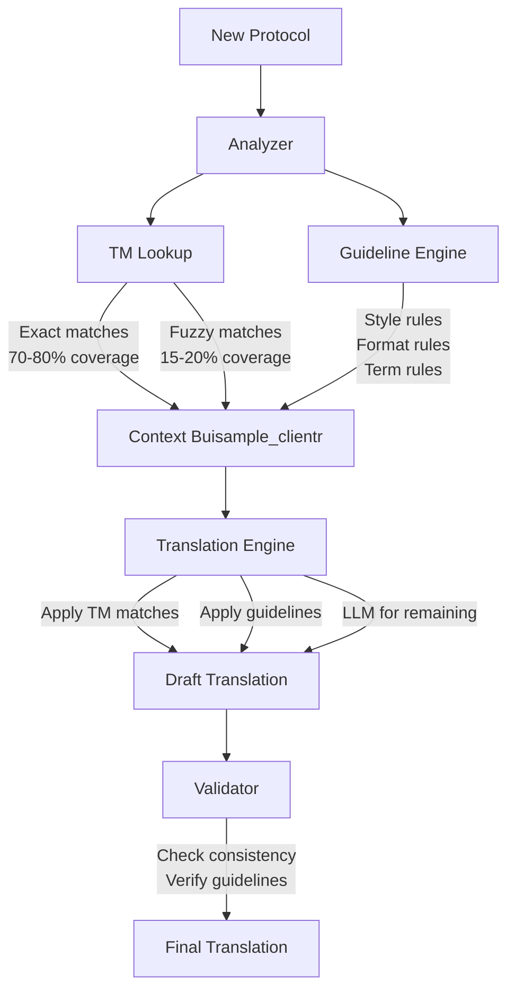

# Protocol Translation Pairs Usage Strategy

## What We Can Extract

### 1. **Translation Memory (TM)**
Direct sentence/paragraph alignments from the paired documents:
- **Exact matches**: Protocol numbers, headers, standard phrases
- **Fuzzy matches**: Similar clinical language patterns
- **Term pairs**: English ↔ Korean terminology mappings

### 2. **System Guidelines**
Translation rules and patterns inferred from the pairs:
- **Formatting rules**: How numbers, lists, tables are handled
- **Style patterns**: Formal tone, passive voice usage
- **Structural rules**: How sections are organized differently
- **Terminology rules**: When to keep English vs translate

## Usage Strategy for New Protocols

### A. Pre-Processing Phase (One-time setup)
```
1. Extract Aligned Pairs
   - Paragraph-level alignment
   - Sentence-level segmentation
   - Create bilingual corpus

2. Generate Translation Memory
   - High-frequency phrases
   - Clinical standard terms
   - Regulatory language

3. Derive System Guidelines
   - Formatting preservation rules
   - Terminology consistency rules
   - Style/tone patterns
```

### B. Runtime Usage for New Protocols

#### **Scenario**: Translating a new clinical protocol (e.g., different sponsor, different drug)



### C. Specific Extractions

#### From Lomond Protocol (EN→KO):
```yaml
TM_Entries:
  - "Inclusion Criteria" → "선정기준"
  - "Exclusion Criteria" → "제외기준"
  - "Primary Endpoint" → "1차 평가변수"
  - "Adverse Event" → "이상반응"
  - "Informed Consent" → "동의서"

Guidelines:
  - Keep protocol numbers unchanged
  - Translate institution names contextually
  - Use formal Korean endings (-습니다)
  - Preserve table structures exactly
```

#### From DW Protocol (KO→EN):
```yaml
TM_Entries:
  - "임상시험 계획서" → "Clinical Trial Protocol"
  - "시험대상자" → "Study Subject"
  - "시험약" → "Investigational Product"
  - "안전성 평가" → "Safety Assessment"

Guidelines:
  - Korean regulatory format → International format
  - Numbered sections → Named sections
  - Korean date format → Western format
```

## Implementation Priority

### Phase 1: TM Extraction (Week 1-2)
1. **Alignment Tool**: Build paragraph/sentence aligner
2. **TM Database**: Store extracted pairs with metadata
3. **Confidence Scoring**: Rate alignment quality

### Phase 2: Guideline Generation (Week 3-4)
1. **Pattern Analysis**: Identify consistent translation patterns
2. **Rule Engine**: Codify guidelines programmatically
3. **Validation**: Test rules against known good translations

### Phase 3: Integration (Week 5-6)
1. **Memory Tiers**: 
   - Tier 1: Cache frequent TM matches
   - Tier 2: Semantic search for similar content
   - Tier 3: Learn from new translations
2. **Orchestration**: Combine TM + Guidelines + LLM

## Expected Coverage for New Protocols

Based on clinical protocol similarity:
- **Direct TM matches**: 40-50% of content
- **Fuzzy TM matches**: 20-30% of content  
- **Guideline-driven**: 20-25% of content
- **Pure LLM translation**: 5-10% of content

This means **90-95% of a new protocol** can leverage extracted knowledge!

## Key Advantages

1. **Consistency**: Same terms always translated the same way
2. **Quality**: Based on professional human translations
3. **Efficiency**: Massive token savings (TM matches = no LLM needed)
4. **Compliance**: Follows proven regulatory standards
5. **Learning**: System improves with each new protocol

## Recommended Next Steps

1. **Build TM Extractor**: Script to align and extract translation pairs
2. **Create Guideline Analyzer**: Pattern detection from aligned pairs
3. **Design Memory Schema**: How to store and retrieve TM/Guidelines
4. **Implement Matcher**: Efficient TM lookup during translation
5. **Test on Subset**: Validate approach with sample sections